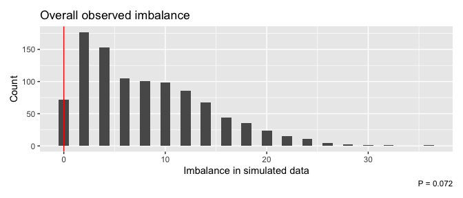

<!-- README.md is generated from README.Rmd. Please edit that file -->

# `randotools` 

<!-- badges: start -->

[](https://github.com/CTU-Bern/randotools)
[](https://github.com/CTU-Bern/randotools/actions)
[](https://CRAN.R-project.org/package=randotools)
<!-- badges: end -->

`randotools` contains functions for creating randomisation lists, and
other related tasks, in R.

## Installation

`randotools` is available from CRAN:

``` r
install.packages("randotools")
```

You can install the development version of `randotools` from github
with:

<!-- install.packages("randotools") -->

``` r
remotes::install_github("CTU-Bern/randotools")
```

Or from CTU Bern’s package universe

``` r
install.packages("randotools", repos = c('https://ctu-bern.r-universe.dev', 'https://cloud.r-project.org'))
```

## Check the imbalance expected for a proposed strata/blocksize combination

Before generating a randomisation list, it can be useful to know whether
the that will be attained with a certain number of strata is going to be
appropriate.

``` r
library(randotools)
set.seed(456)
check_plan(50, n_strata = 5, n_sim = 100)
#> 
#> Number of simulated trials: 100 
#>  Number of participants per trial: 50 
#>  Number of strata: 5 
#>  Blocksizes: 2, 4 
#>  Mean imbalance: 1.66 
#>  Distribution of imbalance:
#>  imbalance  n  % cum%
#>          0 35 35   35
#>          2 49 49   84
#>          4 14 14   98
#>          6  2  2  100
#> 
#> Worst case imbalance from simulations:
#>   arm  n
#> 1   A 22
#> 2   B 28
```

In the above example, we a relatively high degree of imbalance for a
relatively small sample size, so reducing the blocksize or number of
strata would be recommended.

## Generating randomization lists

Generate the randomisation list itself with `randolist`.

``` r
set.seed(123)
r <- randolist(50, arms = c("Trt1", "Trt2"), strata = list(sex = c("Female", "Male")))
```

Create a short summary of the randomisation list with `summary`.

``` r
summary(r)
#> ---- Randomisation list report ----
#> -- Overall
#> Total number of randomisations:  106 
#> Randomisation groups:  Trt1 : Trt2 
#> Randomisation ratio: 1:1 
#> Randomisations to each arm:
#> Trt1 Trt2 
#>   53   53 
#> Block sizes:
#>  2  4  6 
#>  9 13  6 
#> -- Stratifier level 
#> Randomisation list is stratified by variables sex 
#> -  1 
#> Randomisations per level of sex :
#> Female   Male 
#>     54     52 
#> Balance per level of sex :        
#>          Trt1 Trt2
#>   Female   27   27
#>   Male     26   26
#> -- Stratum level 
#> 2 strata are defined:
#> 
#> Female   Male 
#>     54     52 
#> -  Female 
#> Number of randomisations:  54
#> Trt1 Trt2 
#>   27   27 
#> Block sizes: 
#> 2 4 6 
#> 5 5 4 
#> -  Male 
#> Number of randomisations:  52
#> Trt1 Trt2 
#>   26   26 
#> Block sizes: 
#> 2 4 6 
#> 4 8 2
```

Export the randomisation list in a database compatible format with
`randolist_to_db`.

``` r
randolist_to_db(r, target_db = "REDCap",
                strata_enc = list(sex = data.frame(sex = c("Female", "Male"),
                                                   code = 1:2)),
                rando_enc = data.frame(arm = c("Trt1", "Trt2"),
                                       rand_result = 1:2)
                )
```

## Assessing randomisation imbalance

Under some scenarios (e.g. minimization), it can be helpful to monitor
the imbalance of the randomisation process. `randotools` includes some
tools to assist with this, specifically in terms of comparing observed
imbalance with what might be observed with simple random allocation.

`imbalance_seq_plots` shows the evolution of imbalance along the
randomisation sequence:

``` r
data(rando_balance)
imbalance_seq_plots(rando_balance, "rando_res")
```


`imbalance_test` compares the observed imbalance with random allocation,
providing a p-value, which can then be plotted to inspect the observed
(the red line) and simulated imbalances (the bars):

``` r
(imb <- imbalance_test(rando_balance, "rando_res"))
#> Randomisations to date: 100 
#> Overall imbalance: 0 
#>   Probability of equal or less imbalance from random allocation: 0.072
imbalance_test_plot(imb)
```



### Acknowledgements

Development of the package was funded in part via a grant from the
[Swiss Clinical Trial Organization Statistics and Methodology
Platform](https://www.sctoplatforms.ch/en/scto-platforms/statistics-methodology-5.html).

The package logo was created with
[`ggplot2`](https://ggplot2.tidyverse.org/) and
[`hexSticker`](https://github.com/GuangchuangYu/hexSticker) with icons
from [Font Awesome](https://fontawesome.com/).
